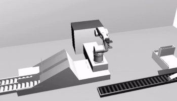
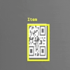

# Simulating a Pick and Place Unit

This project explores model-integrated control and orchestration mechanisms of internet-enabled production robots in a simulated pick and place unit. It lets you control a 6-DOF robotic arm, simulated in Blender GE, and monitor sensor and camera signals over MQTT.

| | <br><sup>Sensor Timeline</sup><br><br><sup>Cameras for Conveyor and QR-Codes</sup>
| :--- | :---: |
|Pick and Place Unit in Blender GE | Sensors and Cameras |

## Getting Started

**Install Dependencies**

You need these dependencies to get started:
* Docker & Docker Compose ([download](https://www.docker.com/community-edition#/download))
* Blender: 2.78c ([download](https://www.blender.org/download/))

**Setup Blender**

Blender requires a few extra libraries in order to be able to publish and subscribe to MQTT queues and render images. To add the necessary scripts and libraries to your installation, go to **File > User Preferences > File > Scripts**.

* If you are using macOS, select the `blender-scripts/`, located in the project root.
* If you are using Windows, similarly select `blender-scripts-win64/`. Then copy the directory `blender-scripts/modules/robot` to `blender-scripts-win64/modules/robot`. This is the main robot controller.

Save the selection by hitting ***Save User Settings***.

Finally, open the simulation file `Pick-and-Place-Simulation.blend` with Blender. Make sure to select **Blender Game** in the engine selection on the top &mdash; it might be set to **Blender Render**.

**Start Docker Services**

In the project root directory, run:

```
docker-compose up
```

This will install and run all additional services to control and monitor the robot. After all services started, the dashboard is available at  [http://localhost:8080](http://localhost:8080). In detail, the services are:

* Control Server (`Port: 8080, Service Name: server`): Collects sensor data and executes the control procedure via MQTT.
* RabbitMQ with MQTT Plugin (`Port 1883, Service Name: mqtt`): MQTT message queue
* InfluxDB (`Port 8086, Service Name: influx`): Time series database for recording sensor measurements
* Camera Object Tracker (`Port 3000, Service Name: object-tracker`): Image recognition service that identifies and locates objects in images

If you only want to start a selection of services, compared to all services, run:

```
docker-compose up service1 service2 ...
```

This is useful, when developing the server - where the server is updated frequently with code changes. Then it is useful to start all services, except for the service `server`:

```
docker-compose up object-tracker mqtt influx
```

### Running Simulations

 Hit `p` in Blender to start a simulation (exit with `Esc`). Now, you can control the robot either manually, by using the arrow keys and `WASD`, or by starting a job in the web view. For this, go to the [web view](http://localhost:8080), select a job and hit ***Play*** in the controls section. This will run the job as described below. Clicking ***Record*** in the dashboard toggles the recording of sensor measurements in InfluxDB. For visualizing these time series, you can use [Chronograf](https://portal.influxdata.com/downloads) or [Grafana](http://grafana.com).

#### Control Procedure

If you select the predefined job "Pick, Heat and Sort", the unit will loop through this sequence of commands:

1. Push item onto conveyor
2. Adjust item to be in pickup window
3. Lift item from conveyor
4. Place item on the platform
5. Scan the QR-code for item class (*Class 1* or *Class 2*)
6. Heat the platform to 120°C for *Class 1* or 150°C for *Class 2*
7. Grab item and drop it over the left slide for *Class 1* or the right slide for *Class 2*
8. Repeat Step 1

## Documentation

A more thorough documentation is available in German [on GitHub](https://github.com/rafaelkonlechner/cdl-digital-twin/blob/master/docs/index.md).

### Notes

This research project is part of the [CDL-MINT](https://cdl-mint.big.tuwien.ac.at/) laboratory for model-integrated smart production.
